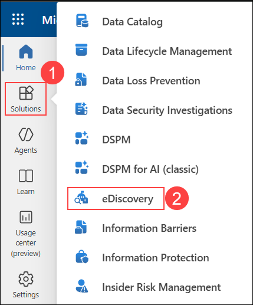
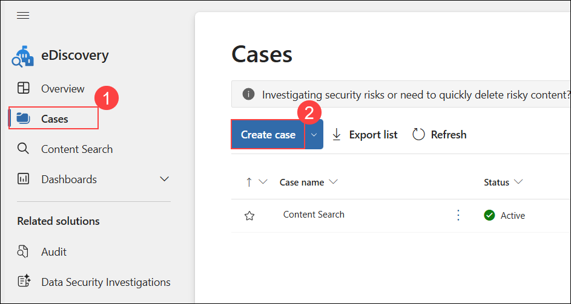
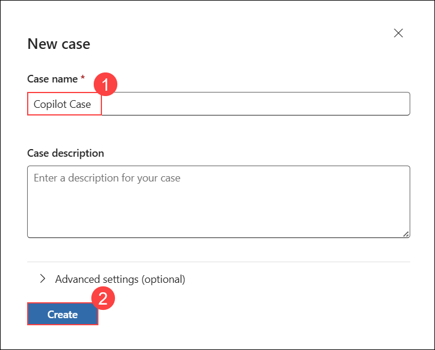
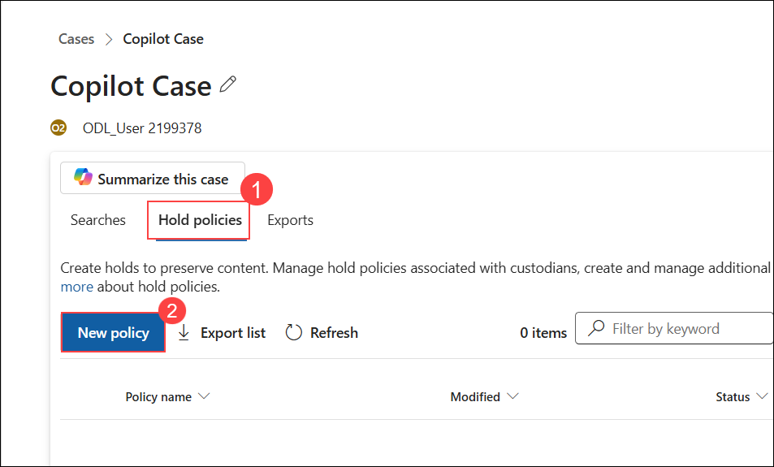
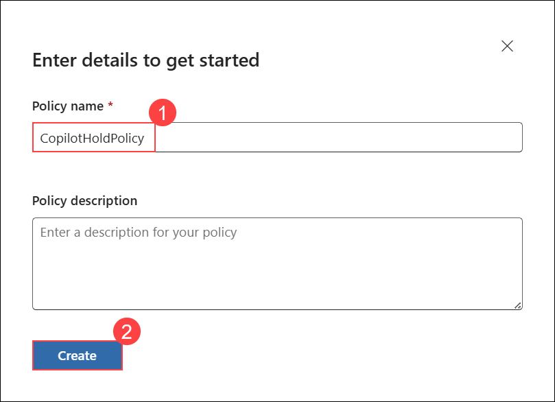

# Exercise 4.7: Reviewing Security and Compliance in Copilot Using eDiscovery (Read Only)

## Introduction

**Microsoft Copilot** is designed with security and compliance in mind. It does not store or share any of the user's data. It only uses the data or information that the user explicitly provides as input or context. It also respects the user's privacy and preferences, and does not collect any personal or sensitive information by itself.

Given below are the capabilities from Microsoft Purview which strengthen your data security and compliance for Microsoft Copilot for Microsoft 365:

## Using eDiscovery in M365 Copilot

**Microsoft Purview eDiscovery (Standard)** provides a basic eDiscovery tool that organizations can use to search and export content in Microsoft 365 and Office 365, including **M365 Copilot**. You can also use eDiscovery (Standard) to place an eDiscovery hold on content locations, such as Exchange mailboxes, SharePoint sites, OneDrive accounts, and Microsoft Teams.

When users within an organization leverage **Microsoft Copilot** to create prompt and response data, it may contain sensitive or confidential information, or evidence of intellectual property. Organizations need to have visibility and control over this data and be able to identify, preserve, collect, review and export it for legal, regulatory or data security investigation. That's why **Microsoft Purview eDiscovery** provides support for **Microsoft 365 Copilot interactions.**

**eDiscovery** has the ability to help with search, discovery, preservation, review and export of Copilot interactions in Microsoft 365 across Word, Excel, PowerPoint, Teams to name a few. It ensures these Copilot conversations are discoverable and actionable through the regular eDiscovery process. It also provides the ability to filter for specific Copilot interactions in the query building experience to make it easier to scope the searches.

>**Note:** You are not expected to perform the following steps. This information is provided solely to give you an understanding of the process of creating and using eDiscovery Cases in the Purview portal. Your access has been set to Global Reader, meaning you won't be able to make changes. These instructions are for viewing only, reflecting the read-only access granted in your environment.

### Task 1: Creating an eDiscovery Case

 Here are the steps to create a case on eDiscovery page in the **Microsoft Compliance portal**.

1. In the **Microsoft Purview** portal, select **Solutions (1)** from the left navigation pane, and then choose **eDiscovery (2)**.

    

1. Select **Cases (1)**, and then choose **Create case (2)**.

    

1. Enter the following name in the **Case name (1)** field, and then select **Create (2)**.

    ```
    Copilot Case
    ```

    

### Optional Task: Creating an eDiscovery hold

After creating an eDiscovery case, you can place a hold (also called an **eDiscovery hold**) on the content locations of the people of interest in your investigation. Content locations include Exchange mailboxes, SharePoint sites, OneDrive accounts, and the mailboxes and sites associated with Microsoft Teams and Microsoft 365 Groups, along with **Microsoft 365 Copilot**. While this step is optional, creating an eDiscovery hold preserves content that may be relevant to the case during the investigation. When you create an **eDiscovery hold** you can preserve all content in specific content locations or you can create a query-based hold to preserve only the content that matches a hold query.

In addition to preserving content, another good reason to create **eDiscovery holds** is to quickly search the content locations on hold (instead of having to select each location to search) when you create and run searches in the next step. After you complete your investigation, you can release any hold that you created.

>**Note:** After you create an eDiscovery hold, it may take up to 24 hours for the hold to take effect.

To create an **eDiscovery hold** that's associated with a **eDiscovery (Standard) case**, follow the given steps:

1. Select **Hold policies (1)**, and then choose **New policy (2)**.

    

1. Enter the following name in the **Policy name (1)** field, and then select **Create (2)**.

    ```
    CopilotHoldPolicy
    ```

    

1. On the **Choose locations** wizard page, choose the content locations that you want to place on hold. You can place mailboxes, sites, and public folders on hold.

    - **Exchange mailboxes:** Set the toggle to **On** and then select Choose users, groups, or teams to specify the mailboxes to place on hold. Use the search box to find user mailboxes and distribution groups (to place a hold on the mailboxes of group members) to place on hold. You can also place a hold on the associated mailbox for a Microsoft Team, Microsoft 365 group, and Viva Engage Group.

    - **SharePoint sites:** Set the toggle to **On** and then select Choose sites to specify SharePoint sites and OneDrive accounts to place on hold. Type the URL for each site that you want to place on hold. You can also add the URL for the SharePoint site for a Microsoft Team, Microsoft 365 group or a Yammer Group.

    - **Exchange public folders:** You can keep this toggle **Off**. You can't choose specific public folders to put on hold. Leave the toggle switch off if you don't want to put a hold on public folders.

    >**Note:** When adding **Exchange mailboxes** or **SharePoint sites** to a hold, you must explicitly add **at least one** content location to the hold. In other words, if you set the toggle to **On** for mailboxes or sites, you must select specific mailboxes or sites to add to the hold. **Otherwise**, the eDiscovery hold will be created but no mailboxes or sites will be added to the hold.

    Select **Next**.

1. To create a query-based hold using keywords or conditions, specifically for **Microsoft 365 Copilot** complete the following steps:

    - In the box under **Keywords**, type a query to preserve only the content that matches the query criteria. You can specify keywords, email message properties, or site properties, such as file names. You can also use more complex queries that use a Boolean operator, such as **AND**, **OR**, or **NOT**.

    - Select **Add condition** to add one or more conditions to narrow the query for the hold. Each condition adds a clause to the KQL search query that is created and run when you create the hold. For example, you can specify a date range so that email or site documents that were created within the date ranged are preserved. A condition is logically connected to the keyword query (specified in the **Keywords** box) and other conditions by the **AND** operator. That means items have to satisfy both the keyword query and the condition to be preserved.

    For creating a hold, because user prompts to **Copilot** and responses from **Copilot** are stored in a user's mailbox, they can be searched and retrieved when the user's mailbox is selected as the source for a search query. Select and retrieve this data from the source mailbox by selecting **Add condition > Type > Copilot interactions**.

    Select **Next**.

1. Review your settings, and then select **Submit**.

1. After some time, your **eDsiscovery hold** will be created. Click on **Done** and return to the **Hold** page.

1. Select your newly created hold and check it got created properly.

## Conclusion

In conclusion, the use of **eDiscovery in Microsoft Copilot** through Microsoft Purview is an integral part of ensuring robust security and compliance measures within Microsoft 365. This exercise has guided users through the process of creating an eDiscovery case, implementing holds on relevant content locations, and performing searches tailored to their investigative needs.

By following these steps, users are equipped with the knowledge and skills to leverage eDiscovery in **Microsoft Copilot** effectively, demonstrating a commitment to maintaining compliance, protecting sensitive data, and swiftly responding to legal or security requirements. The security and privacy principles inherent in **Microsoft Copilot** align with organizational needs, ensuring a balance between innovation and data governance.


## **Congratulations! you have successfully completed this exercise, please click on next**
