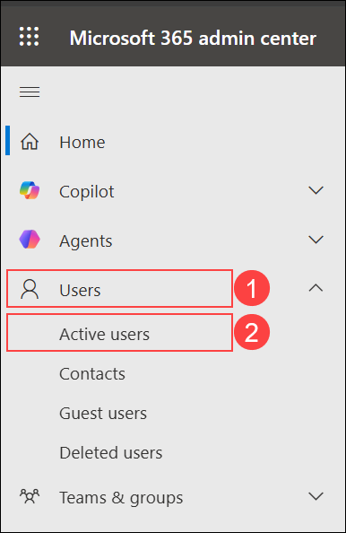
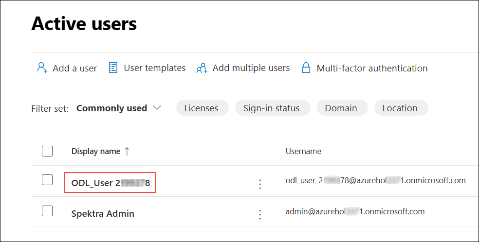
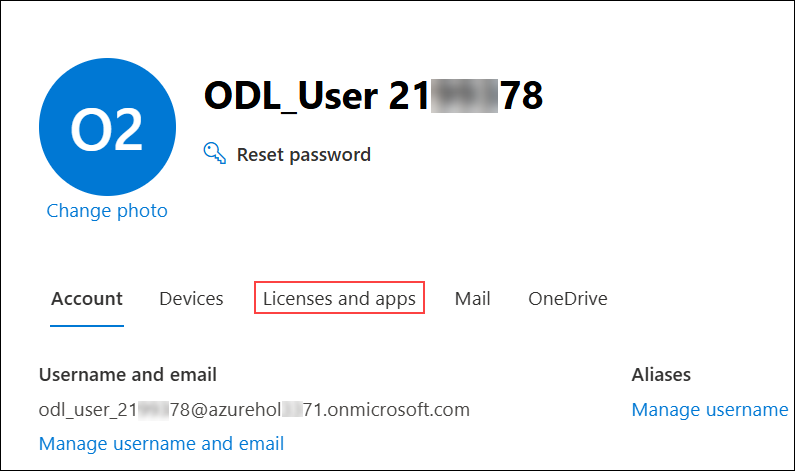
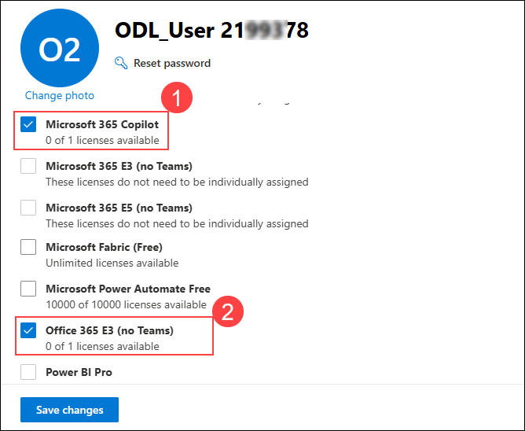

# Exercise 3.1: Administering M365 Copilot
 
In this exercise, you will explore the **Microsoft 365 Admin Center** and learn how to verify **Microsoft Copilot** license assignments for users in your organization. This will help you understand how licenses are managed and monitored in a **Microsoft 365** environment.

## Managing Microsoft 365 Copilot Licenses in Admin Center

In this task, you will navigate to the **Microsoft 365 Admin Center** and verify the **Microsoft 365 Copilot** license assigned to a user in your tenant. You will review the user's license details to confirm that the required licenses are in place.

>**Note:** Your access has been set to Global Reader, so you will not be able to make any changes. These steps are for viewing purposes only.

### Task 1: Verify licenses for the user

Follow these steps to verify the Copilot license assigned to a user from the admin center:

1. Navigate to the **Microsoft 365 Admin Center** using the URL below and sign in with your admin credentials.

    ```
    https://admin.microsoft.com/
    ```

1. From the left navigation pane, click on **Users (1)** and then select **Active users (2)**.

    

1. On the **Active users** page, select **ODL_User <inject key="DeploymentID" enableCopy="false"/>**.

    

1. On the user profile page, click on **Licenses and apps** on the right side to view the license details.

    

1. Under **Licenses and apps**, verify that the required licenses, including **Microsoft 365 Copilot**, are assigned to the user.

    

## Conclusion

In this exercise, you navigated to the **Microsoft 365 Admin Center** and verified the **Microsoft 365 Copilot** license assignment for a user. You reviewed the user's license details to confirm that the required licenses are in place. This is an important step in managing Copilot access within your organization.

## **Congratulations! you have successfully completed this exercise, please click on next**
