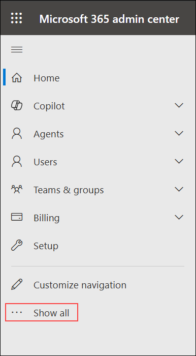
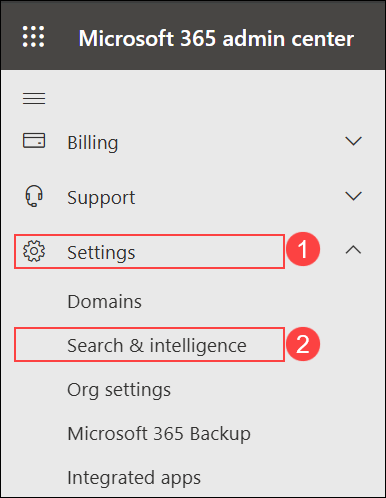
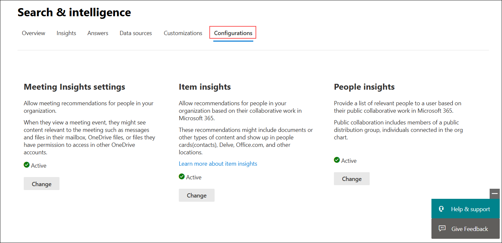
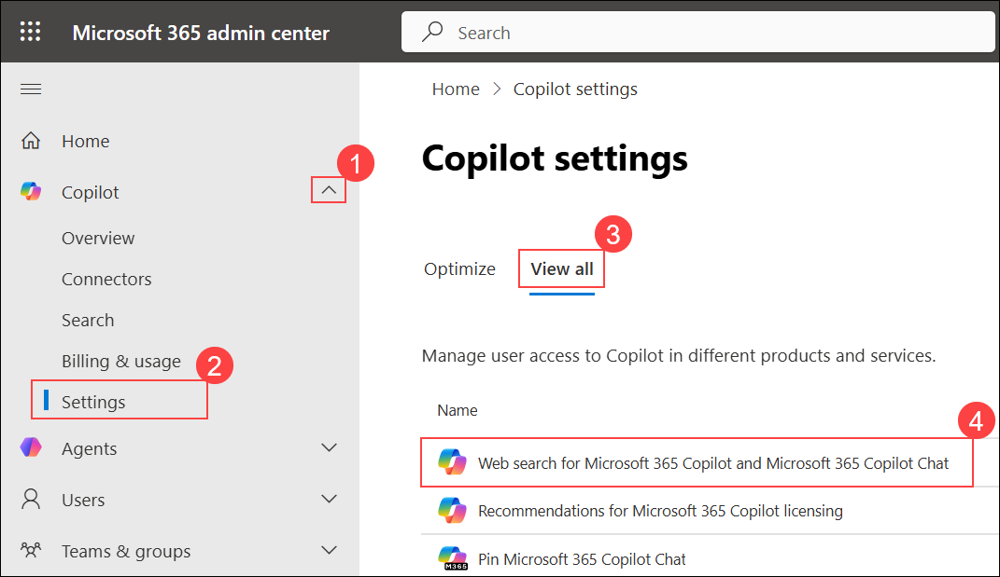
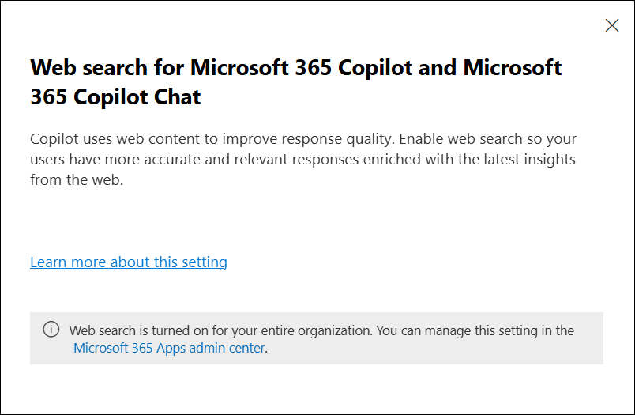
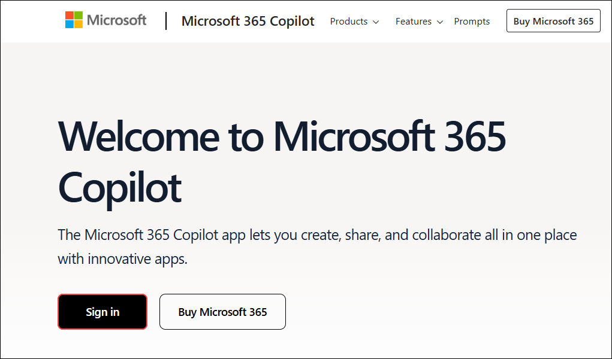
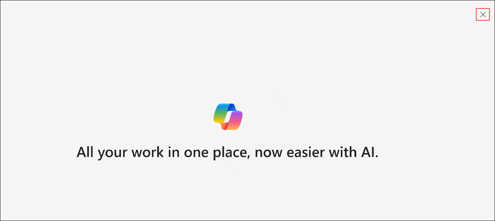
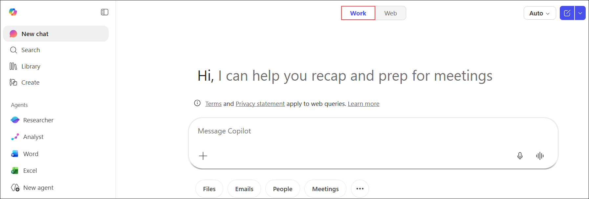
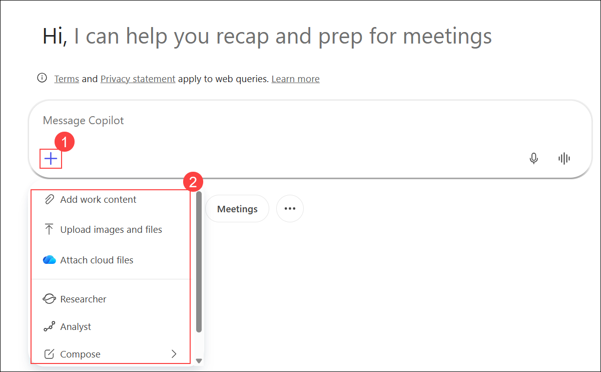

# Exercise 3.3: Administering M365 Copilot

In this exercise, you will review the web search settings for **Microsoft 365 Copilot** in the **Microsoft 365 Admin Center**. You will also verify the Copilot chat experience from the end-user side by navigating to Microsoft 365 and reviewing the available options.

### Task 1: Review public web content access settings

**Microsoft Copilot for Microsoft 365** can reference web content when responding to your prompts in Bing, Microsoft Edge, and the Microsoft Teams app. This feature is turned on by default. In this task, you will review the web search settings in the **Microsoft 365 Admin Center** to confirm that this feature is enabled.

1. In the **Microsoft 365 admin center** navigation pane, select **Show all**.

    

1. In the navigation pane, expand **Settings (1)**, and then select **Search & intelligence (2)**.

    

1. In the **Search & intelligence** page, select **Configurations** and review that the default settings are enabled.

    

1. In the navigation pane, expand **Copilot (1)**, select **Settings (2)**, choose **View all (3)**, and then select **Web search for Microsoft 365 Copilot and Microsoft 365 Copilot Chat (4)**.

    

1. In the **Web search for Microsoft 365 Copilot and Microsoft 365 Copilot Chat** pane, review that web search is enabled by default for the organization.

    

### Task 2: Verify Copilot chat experience as an end user

After the admin enables web content access for **Microsoft 365 Copilot**, you can verify the Copilot chat experience from the end-user side. Follow the steps below to review the available options in Copilot chat:

1. Navigate to the following URL, and then select **Sign in**.

    ```
    https://www.office.com
    ```

    

1. If a pop-up appears, select **Close**.

    

1. On the **Microsoft 365 Copilot** page, verify that the **Work** tab is selected.

    

1. In the **Message Copilot** box, select the **Add (+) (1)** icon, and review the available options **(2)**.

    

## Conclusion

In this exercise, you reviewed the web search settings for **Microsoft 365 Copilot** in the **Microsoft 365 Admin Center** and confirmed that web content access is enabled by default. You also verified the Copilot chat experience from the end-user side by reviewing the available options in the Microsoft 365 Copilot chat interface.

## **Congratulations! you have successfully completed this exercise, please click on next**
