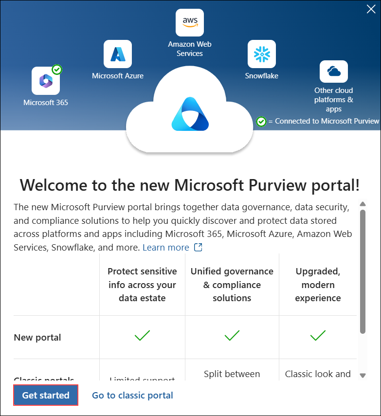
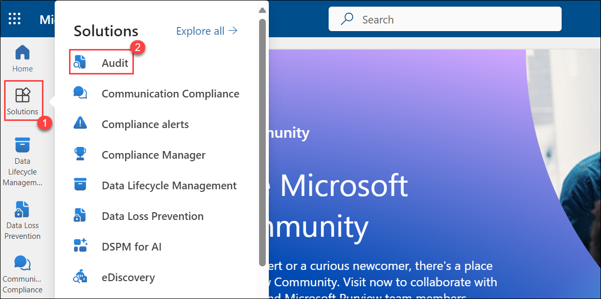
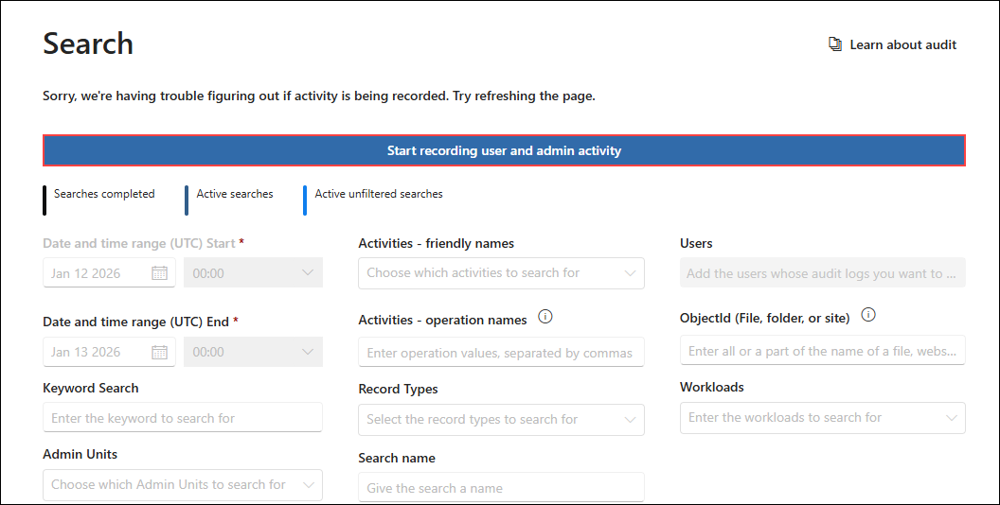
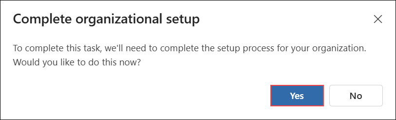
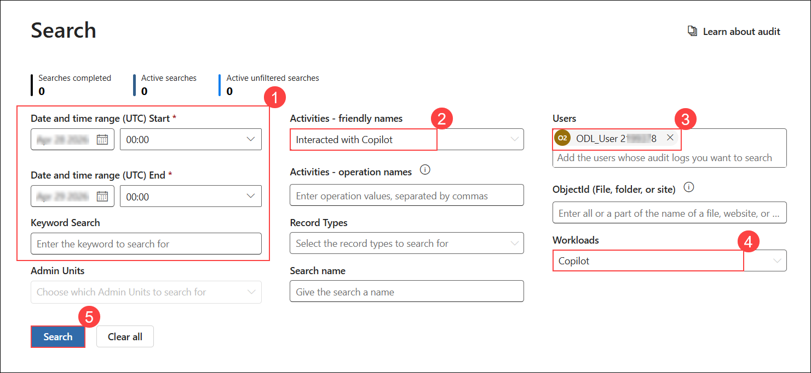

# Exercise 4.5: Reviewing Security and Compliance in Copilot Using Audit

## Introduction

In this exercise, you will use the **Audit** solution in **Microsoft Purview** to search for and review Copilot interaction logs. You will configure an audit search to find user activities related to **Microsoft 365 Copilot** and examine the detailed records.

## Auditing in Microsoft 365 Copilot

Microsoft Purview Audit provides a unified audit log that captures user and admin operations across Microsoft 365 services, including **Microsoft 365 Copilot**. You can search the audit log to find details about how and when users interact with Copilot, which Microsoft 365 service was used, and which files were accessed during the interaction. If those files have a sensitivity label applied, that information is also captured in the audit record.

### Task 1: Search for Copilot activity in the Audit log

In this task, you will access the Audit solution in Microsoft Purview and search for Copilot interaction events.

Copilot events can be accessed in the **Audit** solution from the **Microsoft Purview compliance portal**.

1. Open a new browser tab, copy the following link, and paste it into the address bar to navigate to the Microsoft Purview portal:

   ```
   https://purview.microsoft.com/
   ```

1. On the **Welcome to the new Microsoft Purview portal** screen, click **Get started** to continue with the new unified Microsoft Purview experience.

   

1. In the **Microsoft Purview** portal, in the left navigation pane, select **Solution (1)** and click **Audit (2)**.

   

1. On the Audit page, select the blue bar at the top of the page that says **Start recording and admin activity**. In the pop-up, select **Yes**.

   

   

1. On the **New Search** tab, configure the required options, and then select **Search (5)**.

    - Set the **Date and time range (1)**.
    - Select **Interacted with Copilot (2)** under Activities.
    - Choose **ODL_User <inject key="DeploymentID" enableCopy="false"/> (3)** under Users.
    - Set **Copilot (4)** as the workload.

        

1. The audit log search starts running. When the search is completed, audit records are displayed on the page. Select a record to view a flyout page with detailed properties.

    

1. Review the record entries of the required type.

1. Click on any entry to see more details.

    

1. If you want to download the results as a report, select **Export** at the top of the Audit search results page and choose **Downloads file**.

    

## Conclusion

In this exercise, you used the **Audit** solution in **Microsoft Purview** to search for Copilot interaction events. You configured an audit search with filters for date range, activity type, user, and workload, and reviewed the detailed audit records. You also learned how to export the results for further analysis. Auditing helps you monitor how users interact with Copilot and ensures that file access and sensitivity label usage are tracked.

## **Congratulations! you have successfully completed this exercise, please click on next**
