# Exercise 4.8: Reviewing Security and Compliance in Copilot using Retention Policies

## Introduction

In this exercise, you will create a **retention policy** in **Microsoft Purview** to manage the lifecycle of **Microsoft 365 Copilot** interaction data. You will configure the policy to retain and then delete Copilot messages after a specified period.

## Retention and Deletion in Microsoft 365 Copilot

You can use a retention policy to retain and delete messages from **Microsoft Copilot for Microsoft 365**. Copilot messages (your prompts and Copilot responses) are stored in a hidden folder in your Exchange mailbox. This hidden folder is not directly accessible to you or administrators, but compliance administrators can search it with eDiscovery tools.

After a retention policy is configured, a timer job from the Exchange service periodically evaluates items in this hidden folder. The timer job typically takes 1 to 7 days to run. When items have expired their retention period, they are moved to the **SubstrateHolds** folder (a hidden folder used to store soft-deleted items) before they are permanently deleted.

The following diagram shows the retention lifecycle flow:


For the two paths in the diagram:

1. **If messages are removed from Copilot**, the message is moved to the SubstrateHolds folder where it remains for at least 1 day. When the retention period expires, the message is permanently deleted the next time the timer job runs (typically 1 to 7 days).

1. **If messages remain in Copilot** after the retention period expires, the message is copied to the SubstrateHolds folder. This typically takes 1 to 7 days from the expiry date. The message is then permanently deleted the next time the timer job runs.

>**Note:** Messages stored in mailboxes, including the hidden folders, are searchable by eDiscovery tools until they are permanently deleted from the SubstrateHolds folder.

### Content paths for retain-only retention policy

1. **If messages are removed from Copilot**, the message is moved to the SubstrateHolds folder. If the policy is configured to retain forever, the item remains there. If the retention period has an end date and it expires, the message is permanently deleted the next time the timer job runs.

1. **If messages remain in Copilot**, nothing happens before or after the retention period. The message stays in its original location.

### Content paths for delete-only retention policy

1. **If messages are removed from Copilot** during the retention period, the message is moved to the SubstrateHolds folder and permanently deleted after at least 1 day when the timer job runs.

1. **If messages remain in Copilot** after the retention period expires, the message is copied to the SubstrateHolds folder and permanently deleted after at least 1 day when the timer job runs.

### Task 1: Create and configure a Retention Policy

A retention policy allows you to decide whether to retain content, delete content, or retain and then delete content by assigning retention settings at the container level. For the **Teams chats and Copilot interactions** location, this includes your prompts to **Microsoft Copilot for Microsoft 365** and the responses from Copilot.

In this task, you will create a retention policy for all interactions with **Microsoft 365 Copilot**.

1. In the **Microsoft Purview** portal, select **Solutions (1)** from the left navigation pane, and then choose **Data Lifecycle Management (2)**.

    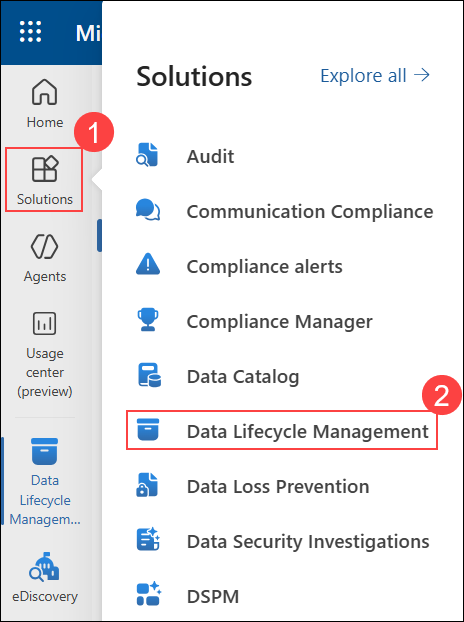

1. Expand **Policies (1)**, and then select **Retention policies (2)**.

    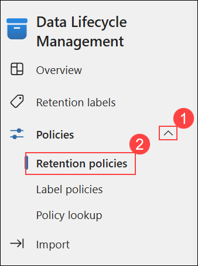

1. Select **New retention policy**.

    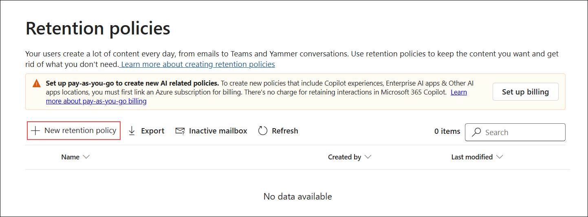

1. Enter the following name in the **Name (1)** field, and then select **Next (2)**.

    ```
    CopilotRetentionPolicy
    ```

    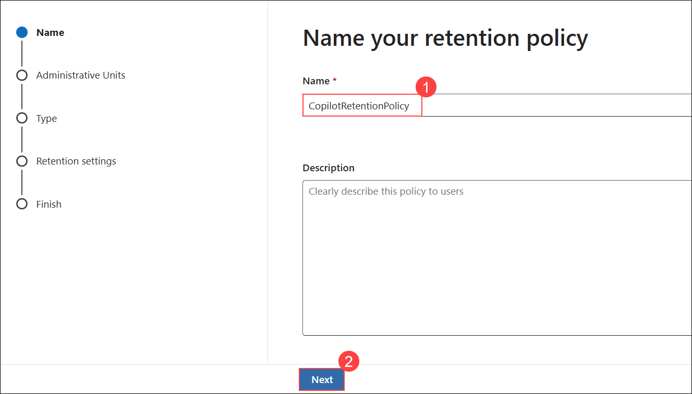

1. On the **Administrative Units** page, click **Next** by keeping the default of **Full directory**.

    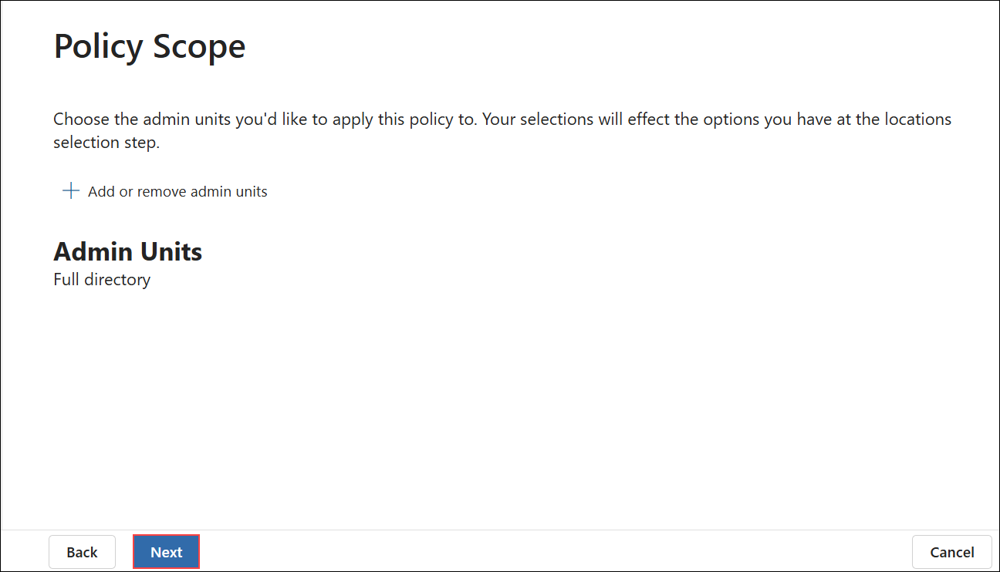

1. On the **Choose the type of retention policy to create** page, select **Static (1)**, and then choose **Next (2)**.

    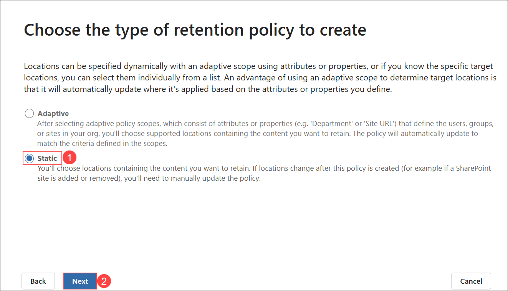

1. Deselect all locations, enable **Teams chats (1)** only, and then select **Next (2)**.

    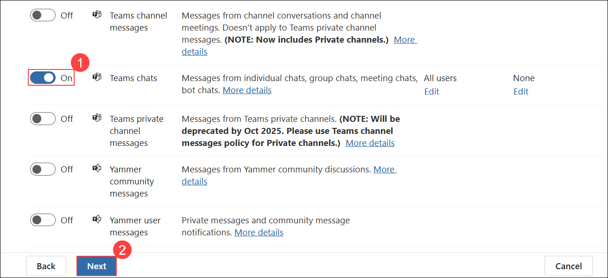

    >**Note:** By default, all teams and all users are selected, but you can refine this by selecting the **Choose** and **Exclude** options.

1. In the **Retain items for a specific period (1)** dropdown, select **Custom (2)**.

    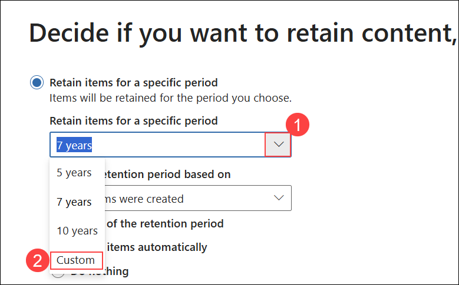

1. Set **years (1)** to **1**, select **Delete items automatically (2)**, and then choose **Next (3)**.

    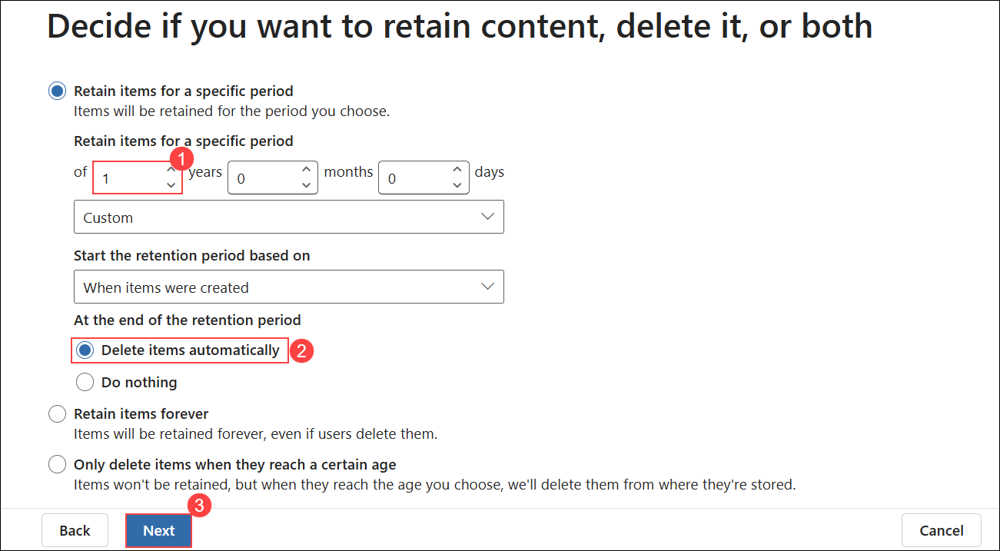

1. On the **Review and finish** page, review the settings, and then select **Submit**.

    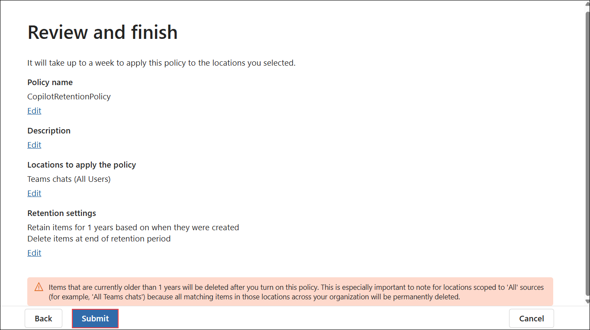

1. Select **Done**.

    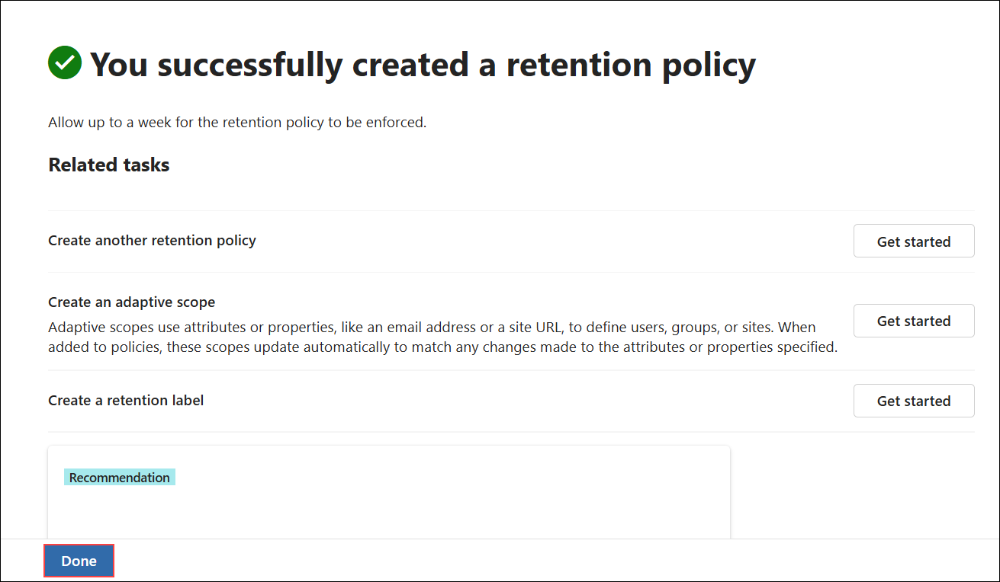

    >**Note:** When you create and submit a retention policy, it can take up to seven days for the retention policy to be applied.

## Conclusion

In this exercise, you created a retention policy in **Microsoft Purview** to manage the lifecycle of **Microsoft 365 Copilot** messages. You configured the policy to retain Copilot interactions for one year and then delete them automatically. You also reviewed how retention and deletion paths work for Copilot messages stored in Exchange mailboxes.

## **Congratulations! you have successfully completed this exercise, please click on next**
